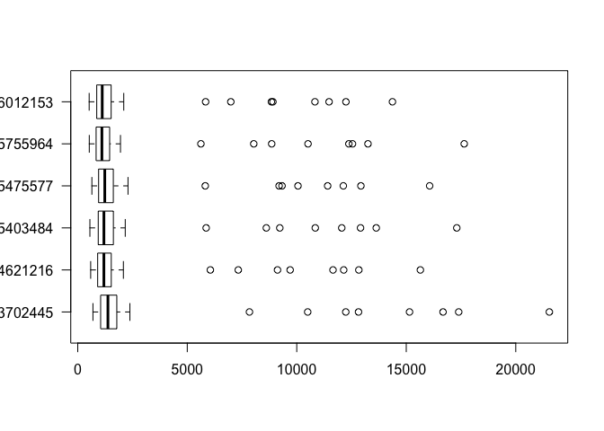
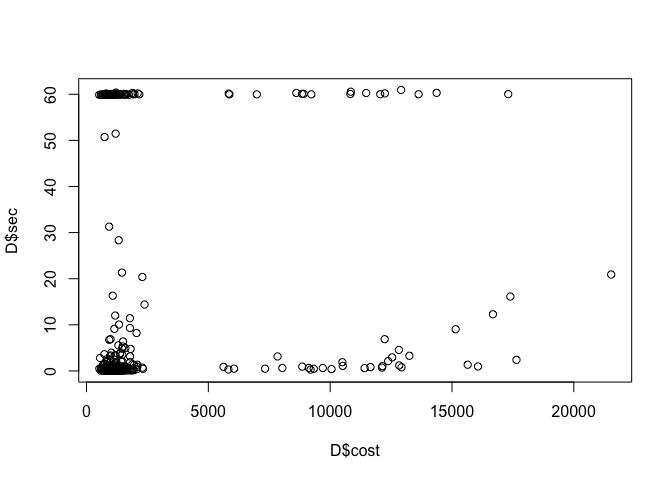

classwork
================

Brief R Tutorial
================

``` r
A<-c(1,2,3)
D<-data.frame(alg=c(1,2,3),res=c(12,10,13))

D<-read.table("../res/res.txt")
colnames(D)<-c("alg","inst","k","cost","sec")
boxplot(cost ~ alg, data=D, horizontal=TRUE)
```



``` r
plot(D$cost,D$sec)
```



``` r
library(dplyr)
```

    ## Warning: package 'dplyr' was built under R version 3.2.5

    ## 
    ## Attaching package: 'dplyr'

    ## The following objects are masked from 'package:stats':
    ## 
    ##     filter, lag

    ## The following objects are masked from 'package:base':
    ## 
    ##     intersect, setdiff, setequal, union

``` r
D<-mutate(D,alg=factor(alg))
```

    ## Warning: package 'bindrcpp' was built under R version 3.2.5

``` r
#D<- D %>% mutate(alg=factor(alg))

D$class<-NA
D$class[ grep("A-", D$inst)] <- "Augerat"
D$class[ grep("CMT", D$inst)] <- "CMT"
D$class[ grep("Golden", D$inst)] <- "Golden"

D <- D %>% mutate(inst=gsub(".xml","",inst)) %>% mutate(inst=factor(inst))
```

``` r
save(D,file="results.rda")
load("results.rda")
```

``` r
require(tidyr)
```

    ## Loading required package: tidyr

    ## Warning: package 'tidyr' was built under R version 3.2.5

``` r
require(xtable)
```

    ## Loading required package: xtable

``` r
xtable(spread(select(D,inst,alg,k),alg,k))
```

    ## % latex table generated in R 3.2.3 by xtable 1.8-2 package
    ## % Wed Apr  1 09:25:49 2020
    ## \begin{table}[ht]
    ## \centering
    ## \begin{tabular}{rlrrrrrr}
    ##   \hline
    ##  & inst & 3702445 & 4621216 & 5403484 & 5475577 & 5755964 & 6012153 \\ 
    ##   \hline
    ## 1 & A-n32-k05 &   5 &   5 &   5 &   5 &   5 &   5 \\ 
    ##   2 & A-n33-k05 &   5 &   5 &   5 &   6 &   5 &   5 \\ 
    ##   3 & A-n33-k06 &   6 &   6 &   6 &   7 &   7 &   6 \\ 
    ##   4 & A-n34-k05 &   6 &   6 &   5 &   5 &   5 &   5 \\ 
    ##   5 & A-n36-k05 &   5 &   5 &   5 &   5 &   5 &   5 \\ 
    ##   6 & A-n37-k05 &   5 &   5 &   5 &   5 &   6 &   5 \\ 
    ##   7 & A-n37-k06 &   7 &   7 &   6 &   7 &   6 &   7 \\ 
    ##   8 & A-n38-k05 &   6 &   6 &   5 &   6 &   6 &   6 \\ 
    ##   9 & A-n39-k05 &   6 &   5 &   5 &   5 &   5 &   5 \\ 
    ##   10 & A-n39-k06 &   7 &   6 &   6 &   6 &   6 &   6 \\ 
    ##   11 & A-n44-k06 &   7 &   6 &   6 &   7 &   7 &   6 \\ 
    ##   12 & A-n45-k06 &   9 &   7 &   6 &   7 &   7 &   7 \\ 
    ##   13 & A-n45-k07 &   8 &   7 &   7 &   7 &   7 &   7 \\ 
    ##   14 & A-n46-k07 &   8 &   7 &   7 &   7 &   7 &   7 \\ 
    ##   15 & A-n48-k07 &   8 &   7 &   7 &   7 &   7 &   7 \\ 
    ##   16 & A-n53-k07 &   8 &   8 &   7 &   8 &   8 &   7 \\ 
    ##   17 & A-n54-k07 &   8 &   8 &   7 &   8 &   7 &   7 \\ 
    ##   18 & A-n55-k09 &  11 &   9 &   9 &  10 &   9 &   9 \\ 
    ##   19 & A-n60-k09 &  10 &   9 &   9 &   9 &   9 &   9 \\ 
    ##   20 & A-n61-k09 &  11 &  11 &  10 &  11 &  10 &  10 \\ 
    ##   21 & A-n62-k08 &   9 &   8 &   8 &   8 &   8 &   8 \\ 
    ##   22 & A-n63-k09 &  11 &  10 &  10 &  10 &  10 &  10 \\ 
    ##   23 & A-n63-k10 &  11 &  11 &  10 &  11 &  10 &  10 \\ 
    ##   24 & A-n64-k09 &  10 &   9 &   9 &   9 &   9 &  10 \\ 
    ##   25 & A-n65-k09 &  11 &  10 &   9 &  10 &  10 &   9 \\ 
    ##   26 & A-n69-k09 &  11 &  10 &   9 &   9 &   9 &   9 \\ 
    ##   27 & A-n80-k10 &  13 &  10 &  10 &  11 &  10 &  10 \\ 
    ##   28 & CMT01 &   6 &   6 &   5 &   6 &   6 &   5 \\ 
    ##   29 & CMT02 &  12 &  11 &  10 &  11 &  11 &  11 \\ 
    ##   30 & CMT03 &   9 &   8 &   8 &   8 &   8 &   8 \\ 
    ##   31 & CMT04 &  14 &  12 &  12 &  12 &  12 &  12 \\ 
    ##   32 & CMT05 &  21 &  17 &  17 &  17 &  17 &  17 \\ 
    ##   33 & CMT11 &   8 &   8 &   7 &   7 &   7 &   7 \\ 
    ##   34 & CMT12 &  10 &  10 &  10 &  10 &  10 &  10 \\ 
    ##   35 & Golden\_01 &  11 &   9 &   9 &   9 &   9 &   9 \\ 
    ##   36 & Golden\_02 &  12 &  10 &  10 &  10 &  10 &  10 \\ 
    ##   37 & Golden\_03 &  12 &   9 &   9 &   9 &   9 &   9 \\ 
    ##   38 & Golden\_04 &  12 &  10 &  10 &  10 &  10 &  10 \\ 
    ##   39 & Golden\_05 &   6 &   5 &   5 &   5 &   5 &   5 \\ 
    ##   40 & Golden\_06 &   7 &   7 &   7 &   7 &   7 &   7 \\ 
    ##   41 & Golden\_07 &   9 &   9 &   8 &   9 &   8 &   9 \\ 
    ##   42 & Golden\_08 &  13 &  10 &  10 &  10 &  10 &  10 \\ 
    ##   43 & Golden\_09 &  17 &  15 &  14 &  15 &  14 &  14 \\ 
    ##   44 & Golden\_10 &  19 &  16 &  16 &  17 &  16 &  16 \\ 
    ##   45 & Golden\_11 &  22 &  18 &  18 &  18 &  18 &  18 \\ 
    ##   46 & Golden\_12 &  24 &  20 &  19 &  20 &  20 &  19 \\ 
    ##   47 & Golden\_13 &  33 &  28 &  26 &  30 &  28 &  26 \\ 
    ##   48 & Golden\_14 &  36 &  31 &  30 &  32 &  31 &  30 \\ 
    ##   49 & Golden\_15 &  39 &  35 &  33 &  36 &  34 &  34 \\ 
    ##   50 & Golden\_16 &  48 &  39 &  37 &  40 &  39 &  37 \\ 
    ##   51 & Golden\_17 &  27 &  22 &  22 &  23 &  24 &  22 \\ 
    ##   52 & Golden\_18 &  33 &  28 &  27 &  28 &  27 &  29 \\ 
    ##   53 & Golden\_19 &  39 &  34 &  33 &  35 &  33 &  34 \\ 
    ##   54 & Golden\_20 &  46 &  39 &  38 &  40 &  39 &  39 \\ 
    ##    \hline
    ## \end{tabular}
    ## \end{table}

``` r
require(dplyr)
EVAL_LONG <- D %>% group_by(inst) %>% mutate(rank=rank(k,na.last = TRUE)) %>% ungroup()
```
