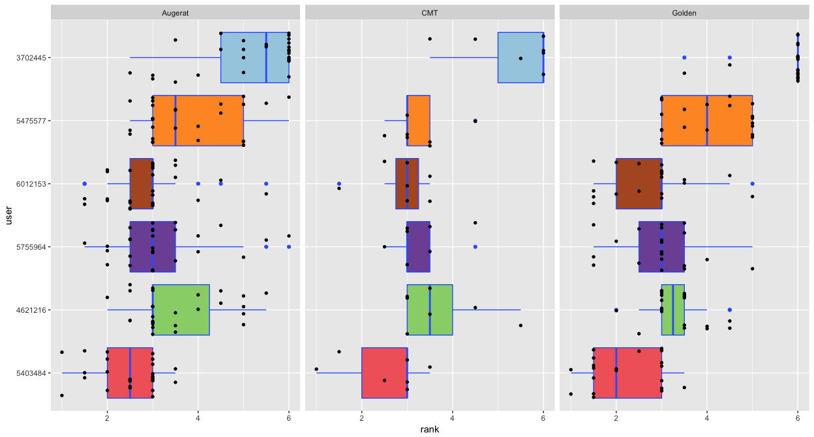

Brief R Tutorial
================

-   [Transformation in ranks](#transformation-in-ranks)
-   [`ggplot2`](#ggplot2)

``` r
A<-c(1,2,3)
D<-data.frame(alg=c(1,2,3),res=c(12,10,13))
```

``` r
D<-read.table("../res/res.txt")
colnames(D)<-c("alg","inst","k","cost","sec")
boxplot(cost ~ alg, data=D, horizontal=TRUE, las=1)
```


``` r
# check `par` to reformat the measures of figure 
```

``` r
plot(D$cost,D$sec,las=1)
```


``` r
library(dplyr)

D<-mutate(D,alg=factor(alg))
#D<- D %>% mutate(alg=factor(alg))

D$class<-NA
D$class[ grep("A-", D$inst)] <- "Augerat"
D$class[ grep("CMT", D$inst)] <- "CMT"
D$class[ grep("Golden", D$inst)] <- "Golden"

D <- D %>% mutate(inst=gsub(".xml","",inst)) %>% mutate(inst=factor(inst))
```

``` r
save(D,file="results.rda")
load("results.rda")
```

``` r
require(tidyr)
spread(select(D,inst,alg,k),alg,k)
```

    ##         inst 3702445 4621216 5403484 5475577 5755964 6012153
    ## 1  A-n32-k05       5       5       5       5       5       5
    ## 2  A-n33-k05       5       5       5       6       5       5
    ## 3  A-n33-k06       6       6       6       7       7       6
    ## 4  A-n34-k05       6       6       5       5       5       5
    ## 5  A-n36-k05       5       5       5       5       5       5
    ## 6  A-n37-k05       5       5       5       5       6       5
    ## 7  A-n37-k06       7       7       6       7       6       7
    ## 8  A-n38-k05       6       6       5       6       6       6
    ## 9  A-n39-k05       6       5       5       5       5       5
    ## 10 A-n39-k06       7       6       6       6       6       6
    ## 11 A-n44-k06       7       6       6       7       7       6
    ## 12 A-n45-k06       9       7       6       7       7       7
    ## 13 A-n45-k07       8       7       7       7       7       7
    ## 14 A-n46-k07       8       7       7       7       7       7
    ## 15 A-n48-k07       8       7       7       7       7       7
    ## 16 A-n53-k07       8       8       7       8       8       7
    ## 17 A-n54-k07       8       8       7       8       7       7
    ## 18 A-n55-k09      11       9       9      10       9       9
    ## 19 A-n60-k09      10       9       9       9       9       9
    ## 20 A-n61-k09      11      11      10      11      10      10
    ## 21 A-n62-k08       9       8       8       8       8       8
    ## 22 A-n63-k09      11      10      10      10      10      10
    ## 23 A-n63-k10      11      11      10      11      10      10
    ## 24 A-n64-k09      10       9       9       9       9      10
    ## 25 A-n65-k09      11      10       9      10      10       9
    ## 26 A-n69-k09      11      10       9       9       9       9
    ## 27 A-n80-k10      13      10      10      11      10      10
    ## 28     CMT01       6       6       5       6       6       5
    ## 29     CMT02      12      11      10      11      11      11
    ## 30     CMT03       9       8       8       8       8       8
    ## 31     CMT04      14      12      12      12      12      12
    ## 32     CMT05      21      17      17      17      17      17
    ## 33     CMT11       8       8       7       7       7       7
    ## 34     CMT12      10      10      10      10      10      10
    ## 35 Golden_01      11       9       9       9       9       9
    ## 36 Golden_02      12      10      10      10      10      10
    ## 37 Golden_03      12       9       9       9       9       9
    ## 38 Golden_04      12      10      10      10      10      10
    ## 39 Golden_05       6       5       5       5       5       5
    ## 40 Golden_06       7       7       7       7       7       7
    ## 41 Golden_07       9       9       8       9       8       9
    ## 42 Golden_08      13      10      10      10      10      10
    ## 43 Golden_09      17      15      14      15      14      14
    ## 44 Golden_10      19      16      16      17      16      16
    ## 45 Golden_11      22      18      18      18      18      18
    ## 46 Golden_12      24      20      19      20      20      19
    ## 47 Golden_13      33      28      26      30      28      26
    ## 48 Golden_14      36      31      30      32      31      30
    ## 49 Golden_15      39      35      33      36      34      34
    ## 50 Golden_16      48      39      37      40      39      37
    ## 51 Golden_17      27      22      22      23      24      22
    ## 52 Golden_18      33      28      27      28      27      29
    ## 53 Golden_19      39      34      33      35      33      34
    ## 54 Golden_20      46      39      38      40      39      39

``` r
spread(select(D,inst,alg,cost),alg,cost)
```

    ##         inst 3702445 4621216 5403484 5475577 5755964 6012153
    ## 1  A-n32-k05    1004     867     935     967     832     817
    ## 2  A-n33-k05     780     743     726     724     696     678
    ## 3  A-n33-k06     837     766     845     869     774     742
    ## 4  A-n34-k05     945     889     789     830     793     785
    ## 5  A-n36-k05     894     862     903     892     805     841
    ## 6  A-n37-k05     826     741     767     863     702     679
    ## 7  A-n37-k06    1096    1112    1080    1116     960    1008
    ## 8  A-n38-k05     909     822     800     816     754     757
    ## 9  A-n39-k05    1036     883     856     902     879     873
    ## 10 A-n39-k06    1050     887     833     868     838     860
    ## 11 A-n44-k06    1138    1029     999    1092     997    1005
    ## 12 A-n45-k06    1226    1014    1143    1109     980     977
    ## 13 A-n45-k07    1390    1250    1316    1245    1197    1203
    ## 14 A-n46-k07    1195     997     988    1092     925     928
    ## 15 A-n48-k07    1366    1232    1228    1217    1100    1113
    ## 16 A-n53-k07    1224    1142    1134    1225    1112    1052
    ## 17 A-n54-k07    1412    1258    1378    1376    1185    1246
    ## 18 A-n55-k09    1332    1158    1154    1234    1109    1078
    ## 19 A-n60-k09    1556    1412    1488    1533    1365    1403
    ## 20 A-n61-k09    1243    1300    1143    1362    1099    1103
    ## 21 A-n62-k08    1592    1379    1459    1466    1368    1391
    ## 22 A-n63-k09    2072    1764    1810    1851    1663    1737
    ## 23 A-n63-k10    1640    1504    1466    1532    1347    1399
    ## 24 A-n64-k09    1725    1530    1595    1552    1456    1525
    ## 25 A-n65-k09    1500    1274    1377    1442    1249    1184
    ## 26 A-n69-k09    1481    1297    1333    1375    1185    1212
    ## 27 A-n80-k10    2321    1903    2053    1940    1803    1968
    ## 28     CMT01     694     604     554     700     582     521
    ## 29     CMT02    1045     920     984     952     884     867
    ## 30     CMT03    1068     985     931    1033     871     839
    ## 31     CMT04    1408    1196    1195    1234    1105    1045
    ## 32     CMT05    1790    1496    1645    1561    1351    1358
    ## 33     CMT11    1458    1111    1321    1095    1037    1247
    ## 34     CMT12     968     909    1077     884     826     901
    ## 35 Golden_01    7840    6055    5863    5822    5623    5838
    ## 36 Golden_02   12238    9121    9226    9328    8856    8911
    ## 37 Golden_03   16680   12144   12912   12126   12545   11476
    ## 38 Golden_04   21534   15644   17307   16068   17646   14369
    ## 39 Golden_05   10500    7330    8610    9194    8037    6989
    ## 40 Golden_06   12820    9698   10846   10056   10515    8843
    ## 41 Golden_07   15149   11655   12055   11411   12379   10831
    ## 42 Golden_08   17395   12835   13630   12929   13252   12246
    ## 43 Golden_09     732     590     590     645     526     630
    ## 44 Golden_10     933     763     752     815     672     809
    ## 45 Golden_11    1178     963     935    1039     833     986
    ## 46 Golden_12    1455    1192    1193    1217    1017    1204
    ## 47 Golden_13    1191     972     967    1119     944     937
    ## 48 Golden_14    1500    1194    1313    1371    1186    1224
    ## 49 Golden_15    1781    1501    1577    1704    1474    1519
    ## 50 Golden_16    2291    1880    1911    2083    1787    1887
    ## 51 Golden_17     965     774     797     929     739     727
    ## 52 Golden_18    1309    1108    1130    1262    1063    1122
    ## 53 Golden_19    1783    1578    1627    1624    1424    1554
    ## 54 Golden_20    2381    2084    2168    2295    1951    2101

``` r
spread(select(D,inst,alg,sec),alg,sec)
```

    ##         inst 3702445 4621216 5403484 5475577 5755964 6012153
    ## 1  A-n32-k05    0.32    0.29    1.07    0.13    0.02   60.02
    ## 2  A-n33-k05    0.33    0.27    1.50    0.13    0.03   59.93
    ## 3  A-n33-k06    0.32    0.31    0.93    0.14    0.03   50.72
    ## 4  A-n34-k05    0.32    0.30    0.96    0.13    0.04   59.91
    ## 5  A-n36-k05    0.34    0.30    1.11    0.12    0.05   60.01
    ## 6  A-n37-k05    0.34    0.30    1.58    0.13    0.04   59.90
    ## 7  A-n37-k06    0.32    0.30    1.34    0.14    0.03   60.02
    ## 8  A-n38-k05    0.33    0.28    1.14    0.13    0.04   59.85
    ## 9  A-n39-k05    0.33    0.27    1.26    0.13    0.04   60.02
    ## 10 A-n39-k06    0.34    0.30    2.00    0.13    0.05   59.87
    ## 11 A-n44-k06    0.32    0.30    2.32    0.14    0.04   60.03
    ## 12 A-n45-k06    0.34    0.30    1.13    0.16    0.06   59.87
    ## 13 A-n45-k07    0.33    0.33    1.20    0.12    0.04   59.98
    ## 14 A-n46-k07    0.35    0.31    3.36    0.14    0.04   59.89
    ## 15 A-n48-k07    0.34    0.32    1.88    0.14    0.05   59.99
    ## 16 A-n53-k07    0.35    0.29    2.48    0.14    0.06   59.88
    ## 17 A-n54-k07    0.36    0.30    3.87    0.13    0.05   60.01
    ## 18 A-n55-k09    0.37    0.29    3.32    0.14    0.05   59.89
    ## 19 A-n60-k09    0.34    0.30    5.30    0.14    0.05   60.00
    ## 20 A-n61-k09    0.39    0.31    9.12    0.14    0.06   59.88
    ## 21 A-n62-k08    0.39    0.31    4.84    0.15    0.05   59.92
    ## 22 A-n63-k09    0.38    0.29    4.77    0.14    0.07   59.89
    ## 23 A-n63-k10    0.37    0.31    3.51    0.14    0.06   60.02
    ## 24 A-n64-k09    0.35    0.32    4.96    0.14    0.06   59.91
    ## 25 A-n65-k09    0.37    0.30    3.73    0.14    0.06   60.03
    ## 26 A-n69-k09    0.39    0.31   10.06    0.14    0.09   59.89
    ## 27 A-n80-k10    0.45    0.31    8.23    0.15    0.11   60.01
    ## 28     CMT01    0.35    0.30    2.81    0.14    0.05   59.88
    ## 29     CMT02    0.42    0.31    6.89    0.14    0.07   60.01
    ## 30     CMT03    0.54    0.33   31.29    0.16    0.11   59.91
    ## 31     CMT04    1.02    0.38   51.46    0.21    0.43   60.04
    ## 32     CMT05    1.91    0.43   59.96    0.24    0.51   59.96
    ## 33     CMT11    0.69    0.34   28.34    0.17    0.21   60.04
    ## 34     CMT12    0.52    0.32   16.32    0.15    0.12   59.90
    ## 35 Golden_01    3.14    0.49   59.97    0.32    0.89   60.14
    ## 36 Golden_02    6.89    0.66   59.98    0.48    0.94   60.08
    ## 37 Golden_03   12.29    1.04   60.93    0.71    2.94   60.27
    ## 38 Golden_04   20.91    1.35   60.02    0.97    2.40   60.30
    ## 39 Golden_05    1.89    0.49   60.28    0.29    0.64   59.97
    ## 40 Golden_06    4.56    0.63   60.55    0.40    1.09   60.09
    ## 41 Golden_07    9.04    0.83   60.00    0.62    2.14   60.06
    ## 42 Golden_08   16.13    1.20   60.00    0.79    3.29   60.18
    ## 43 Golden_09    3.62    0.52   59.95    0.35    0.51   59.85
    ## 44 Golden_10    6.75    0.74   59.98    0.49    1.24   60.17
    ## 45 Golden_11   12.01    0.99   60.00    0.70    2.52   60.05
    ## 46 Golden_12   21.33    1.43   59.99    0.93    3.95   60.36
    ## 47 Golden_13    3.41    0.58   59.94    0.32    0.90   59.97
    ## 48 Golden_14    6.39    0.74   59.96    0.46    1.75   60.16
    ## 49 Golden_15   11.44    0.96   59.96    0.64    2.04   60.05
    ## 50 Golden_16   20.38    1.43   60.00    0.86    3.16   60.29
    ## 51 Golden_17    3.15    0.60   59.95    0.32    0.49   59.89
    ## 52 Golden_18    5.55    0.66   59.94    0.41    0.69   60.11
    ## 53 Golden_19    9.31    1.02   59.98    0.53    2.05   60.07
    ## 54 Golden_20   14.40    1.35   59.98    0.71    1.33   60.18

``` r
require(tidyr)
require(xtable)
print(xtable(spread(select(D,inst,alg,k),alg,k)),n=3)
# prints latex code. redirect to file
```

Transformation in ranks
-----------------------

``` r
require(dplyr)
EVAL_LONG <- D %>% group_by(inst) %>% mutate(rank=rank(k,na.last = TRUE)) %>% ungroup()
EVAL_LONG
```

    ## # A tibble: 324 x 7
    ##        alg      inst     k  cost   sec  class  rank
    ##     <fctr>    <fctr> <int> <dbl> <dbl>  <chr> <dbl>
    ##  1 3702445 Golden_20    46  2381 14.40 Golden     6
    ##  2 3702445 Golden_19    39  1783  9.31 Golden     6
    ##  3 3702445 Golden_18    33  1309  5.55 Golden     6
    ##  4 3702445 Golden_17    27   965  3.15 Golden     6
    ##  5 3702445 Golden_16    48  2291 20.38 Golden     6
    ##  6 3702445 Golden_15    39  1781 11.44 Golden     6
    ##  7 3702445 Golden_14    36  1500  6.39 Golden     6
    ##  8 3702445 Golden_13    33  1191  3.41 Golden     6
    ##  9 3702445 Golden_12    24  1455 21.33 Golden     6
    ## 10 3702445 Golden_11    22  1178 12.01 Golden     6
    ## # ... with 314 more rows

``` r
# tbl_df(EVAL_LONG) # from tibble to data frame to show all rows 
```

`ggplot2`
---------

We prepare colors that we will use in the plot. One different color for each algorithm.

``` r
# we prepare the colors
library(RColorBrewer)
colfun <- colorRampPalette(brewer.pal(12, "Paired"))
myColors <- colfun(nlevels(D$alg)) # we keep out the entries from the previous year
# myColors <- c(myColors,rep("#FFFFFF",9)) # white for the entries from the previous year
names(myColors)<-levels(D$alg)
```

We proceed by defining the ggplot in his layers:

``` r
require(ggplot2)
# we start the plot saying defining the data and aestetics levels
g <- ggplot(EVAL_LONG,aes(x=reorder(alg, rank, median), y=rank)) 
# we define the geometrical object 
g <- g + geom_boxplot(aes(fill=alg),width=0.8,stat = "boxplot",
                  position = position_dodge(width = 0),
                  colour = I("#3366FF"),outlier.colour = I("#3366FF"))
g <- g + guides(fill=FALSE) # remove the fill legend
# we overimpose another geometrical object
g <- g + geom_jitter(size=1.2,position = position_jitter(height=0,width=0.4))
# we define the facets
g <- g + facet_grid(.~class) # faceting
# We can control the coordinates
# g <- g + coord_cartesian(ylim=c(1,nlevels(EVAL_LONG$alg))) 
# g <- g + scale_y_continuous(breaks=seq(1, nlevels(EVAL_LONG$alg), 1))
# g <- g + scale_y_continuous(limits=c(1,nlevels(DATA$alg)))
# the color is also a coordinate se we specify colors:
g <- g + scale_fill_manual(name = "alg", values = myColors)
g <- g + coord_flip() # show the plot horizontally
g <- g + labs(x="user")
# we could change the theme
print(g)
```



``` r
require(dplyr)
EVAL_LONG <- EVAL_LONG %>% mutate(alg=factor(alg,levels=levels(reorder(EVAL_LONG$alg, EVAL_LONG$rank, median))))
```
