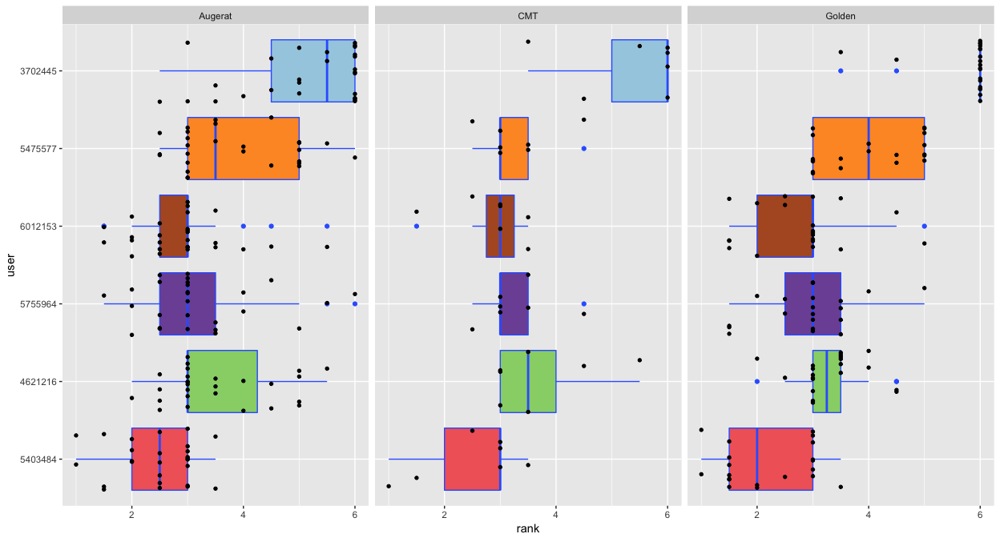

classwork
================

-   [Brief R Tutorial](#brief-r-tutorial)
-   [Transformation in ranks](#transformation-in-ranks)

Brief R Tutorial
----------------

``` r
A<-c(1,2,3)
D<-data.frame(alg=c(1,2,3),res=c(12,10,13))

D<-read.table("../res/res.txt")
colnames(D)<-c("alg","inst","k","cost","sec")
boxplot(cost ~ alg, data=D, horizontal=TRUE, las=1)
```


``` r
plot(D$cost,D$sec,las=1)
```


``` r
library(dplyr)

D<-mutate(D,alg=factor(alg))
#D<- D %>% mutate(alg=factor(alg))

D$class<-NA
D$class[ grep("A-", D$inst)] <- "Augerat"
D$class[ grep("CMT", D$inst)] <- "CMT"
D$class[ grep("Golden", D$inst)] <- "Golden"

D <- D %>% mutate(inst=gsub(".xml","",inst)) %>% mutate(inst=factor(inst))
```

``` r
save(D,file="results.rda")
load("results.rda")
```

``` r
require(tidyr)
require(xtable)
print(xtable(spread(select(D,inst,alg,k),alg,k)),n=3)
# prints latex code. redirect to file
```

Transformation in ranks
-----------------------

``` r
require(dplyr)
EVAL_LONG <- D %>% group_by(inst) %>% mutate(rank=rank(k,na.last = TRUE)) %>% ungroup()
EVAL_LONG
```

    ## # A tibble: 324 x 7
    ##        alg      inst     k  cost   sec  class  rank
    ##     <fctr>    <fctr> <int> <dbl> <dbl>  <chr> <dbl>
    ##  1 3702445 Golden_20    46  2381 14.40 Golden     6
    ##  2 3702445 Golden_19    39  1783  9.31 Golden     6
    ##  3 3702445 Golden_18    33  1309  5.55 Golden     6
    ##  4 3702445 Golden_17    27   965  3.15 Golden     6
    ##  5 3702445 Golden_16    48  2291 20.38 Golden     6
    ##  6 3702445 Golden_15    39  1781 11.44 Golden     6
    ##  7 3702445 Golden_14    36  1500  6.39 Golden     6
    ##  8 3702445 Golden_13    33  1191  3.41 Golden     6
    ##  9 3702445 Golden_12    24  1455 21.33 Golden     6
    ## 10 3702445 Golden_11    22  1178 12.01 Golden     6
    ## # ... with 314 more rows

``` r
# tbl_df(EVAL_LONG) # from tibble to data frame to show all rows 
```

We can order the levels of the `alg` factor as follows:

``` r
require(ggplot2)
p <- ggplot(EVAL_LONG,aes(x=reorder(alg, rank, median), y=rank)) # we start the plot saying which data and aestetics to use
p <- p + geom_boxplot(aes(fill=alg),width=0.8,stat = "boxplot",
                  position = position_dodge(width = 0),
                  colour = I("#3366FF"),outlier.colour = I("#3366FF"))
p <- p + guides(fill=FALSE) # remove the fill legend
p <- p + geom_jitter(size=1.2,position = position_jitter(height=0,width=0.4))
p <- p + coord_cartesian(ylim=c(1,nlevels(EVAL_LONG$alg))) 
p <- p + scale_y_continuous(breaks=seq(1, nlevels(EVAL_LONG$alg), 1))
# p <- p + scale_y_continuous(limits=c(1,nlevels(DATA$alg)))
p <- p + labs(x="user")
p <- p + coord_flip() # show the plot horizontally
#p <- p + scale_fill_manual(name = "alg", values = myColors)
#p <- p + facet_grid(class~.)
p <- p + facet_grid(.~class) # faceting
print(p)
```



``` r
require(dplyr)
EVAL_LONG <- EVAL_LONG %>% mutate(alg=factor(alg,levels=levels(reorder(EVAL_LONG$alg, EVAL_LONG$rank, median))))
```

``` r
# we prepare the colors
library(RColorBrewer)
colfun <- colorRampPalette(brewer.pal(12, "Paired"))
myColors <- colfun(nlevels(D$alg)) # we keep out the entries from the previous year
# myColors <- c(myColors,rep("#FFFFFF",9)) # white for the entries from the previous year
names(myColors)<-levels(D$alg)
```
